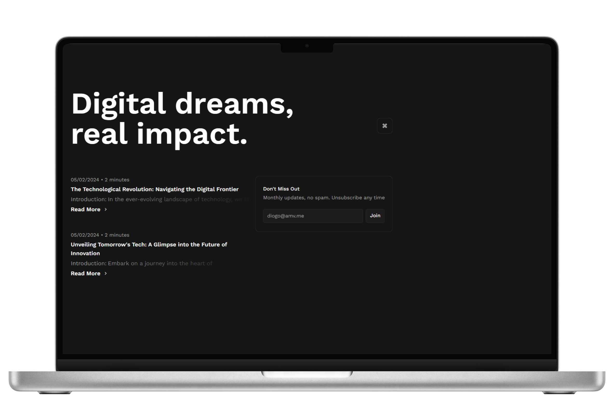

<p align="center">
   
</p>

<h1 align="center">Bit Blog</h1>

<h3 align="center">
  :rocket: Blog de tecnologia com o foco na língua inglesa. 🚀
</h3>


# :computer: Tecnologias

Este projeto foi feito utilizando as seguintes tecnologias:

### Front-end

- **[Next.js](https://nextjs.org/)** 
- **[Tailwind CSS](https://tailwindcss.com/)**
- **[Axios](https://axios-http.com/ptbr/docs/intro)**
- **[Kbar](https://kbar.vercel.app/)** 
- **[Jsonwebtoken](https://github.com/auth0/node-jsonwebtoken)** 
- **[TypeScript](https://www.typescriptlang.org/)** 

### Back-end

- **[.NET](https://dotnet.microsoft.com/)**
- **[PostgreSQL](https://www.postgresql.org/)**
- **[Entity Framework](https://docs.microsoft.com/en-us/ef/)** 
- **[BCrypt](https://github.com/kelektiv/node.bcrypt.js/)**

## Como Iniciar?

### Requisitos

- [Node.js](https://nodejs.org/)
- [.NET SDK](https://dotnet.microsoft.com/download)
- [PostgreSQL](https://www.postgresql.org/download/)

**Clone o projeto e acesse a pasta**

```bash
git clone https://github.com/DiogoAMV/bit.git && cd bit
```

**Siga os passos abaixo**

### API

```bash
# Na pasta raiz do projeto, acesse a pasta 'api'
$ cd api
# Instale as dependências
$ dotnet restore
# Configure o banco de dados PostgreSQL em appsettings.json
# Com um contêiner PostgreSQL em execução, execute a api
$ dotnet watch
```

### WEB

**Certifique-se de ter a api rodando**

```bash
# Na pasta raiz do projeto, acesse a pasta 'web'
$ cd web
# Instale as dependências
$ npm install
# Inicie a aplicação
$ npm run dev
```

## :memo: Licença

Esse projeto está sob a licença MIT. Veja o arquivo [LICENSE](LICENSE.md) para mais detalhes.

---

Feito com :purple_heart: by [Diogo Marques](https://github.com/DiogoAMV)

[](https://www.linkedin.com/in/diogo-marques-719950221/) 
[](mailto:contato.diogoamv@gmail.com)
